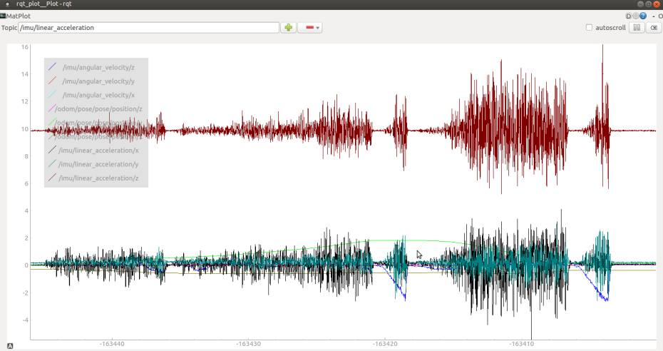
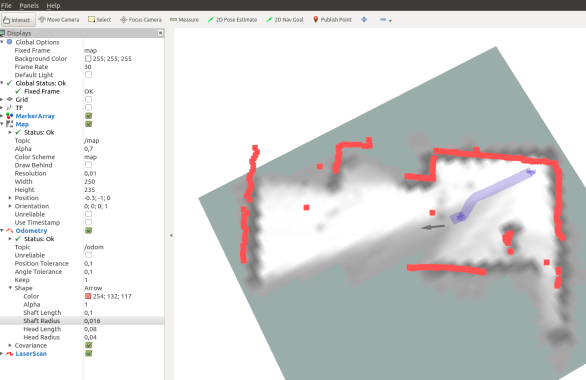
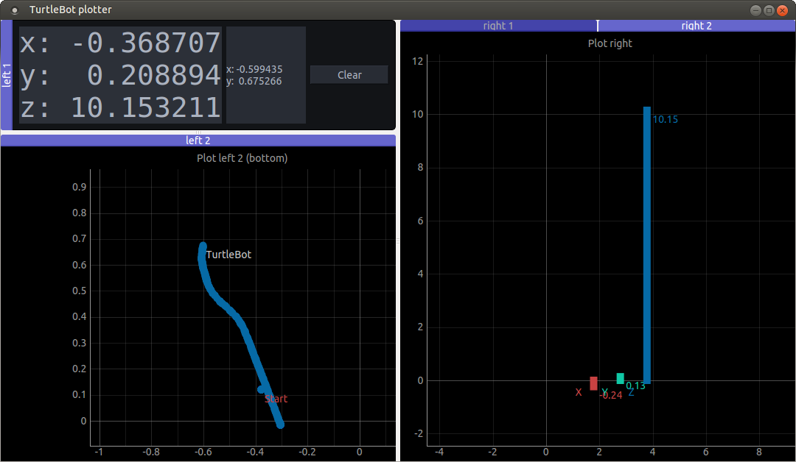

# Rosbag gyakorlás

## Tartalom
- [Előkészületek, rosbag visszajátszása](#elo)
- [Topicok elérése - terminalból](#term)
- [Topicok elérése - rqt_plot](#rqtplot)
- [Topicok elérése - rviz](#rviz)
- [Topicok elérése - saját python kóddal](#python)

<a name="elo"></a>

## Előkészületek

Nyissunk egy terminált (`ctr`+`alt`+`t`), hozzunk létre egy `rosbag-gyak` mappát, majd lépjünk bele.

```
mkdir ~/rosbag-gyak
cd ~/rosbag-gyak
```

Töltsünk le egy rosbag fájlt.

```
wget www.sze.hu/~herno/PublicDataAutonomous/turtlebot-2019-03-11-SLAM-no-camera.bag
```

Vizsgáljuk meg, hogy tényleg ~46MB méretű-e a `.bag` fájl.

```
ls -l
ls -l --block-size=M
```

Nézzük meg a következő videót, ez a `.bag` fájl rögzítésekor készült: [youtu.be/QwagQFvhbNU](https://www.youtube.com/watch?v=QwagQFvhbNU)

_Megjegyzés_: www.sze.hu/~herno/PublicDataAutonomous linken további `.bag` fájlok találhatóak.

A terminalban indítsunk egy `roscore`-t.

```
roscore
```

Nyissunk egy újabb tabot a terminálban (`ctr`+`shift`+`t`). Ha nem `rosbag-gyak`-ban lennénk, `cd`-zzünk. A `-l` kapcsoló loopolja a bag-et, a `play` mondja meg, hogy lejátszuk és nem például rögzítjük a bag-et.

```
cd ~/rosbag-gyak
rosbag play -l turtlebot-2019-03-11-SLAM-no-camera.bag 
```
<a name="term"></a>

## Topicok terminalból

Nyissunk egy újabb tabot a terminálban (`ctr`+`shift`+`t`), majd vizsgáljuik meg a topicokat.

```
rostopic list 
```
Ezt kellene látnunk.

```
    /battery_state
    /clock
    /cmd_vel
    /cmd_vel_rc100
    /constraint_list
    /diagnostics
    /firmware_version
    /flat_imu
    /imu
    /joint_states
    /landmark_poses_list
    /magnetic_field
    /map
    /move_base/TebLocalPlannerROS/parameter_descriptions
    /move_base/TebLocalPlannerROS/parameter_updates
    /move_base/global_costmap/costmap
    /move_base/global_costmap/costmap_updates
    /move_base/global_costmap/footprint
    /move_base/global_costmap/inflation_layer/parameter_descriptions
    /move_base/global_costmap/inflation_layer/parameter_updates
    /move_base/global_costmap/obstacle_layer/parameter_descriptions
    /move_base/global_costmap/obstacle_layer/parameter_updates
    /move_base/global_costmap/parameter_descriptions
    /move_base/global_costmap/parameter_updates
    /move_base/global_costmap/static_layer/parameter_descriptions
    /move_base/global_costmap/static_layer/parameter_updates
    /move_base/local_costmap/costmap
    /move_base/local_costmap/costmap_updates
    /move_base/local_costmap/footprint
    /move_base/local_costmap/inflation_layer/parameter_descriptions
    /move_base/local_costmap/inflation_layer/parameter_updates
    /move_base/local_costmap/obstacle_layer/parameter_descriptions
    /move_base/local_costmap/obstacle_layer/parameter_updates
    /move_base/local_costmap/parameter_descriptions
    /move_base/local_costmap/parameter_updates
    /move_base/parameter_descriptions
    /move_base/parameter_updates
    /move_base/status
    /odom
    /rosout
    /rosout_agg
    /rpms
    /scan
    /scan_matched_points2
    /sensor_state
    /submap_list
    /tf
    /tf_static
    /trajectory_node_list
```

Vizsgáljunk meg minél több topicot `rostopic type` illetve `rosmsg show`-val.

```
rostopic type /odom | rosmsg show
```

``` c
    std_msgs/Header header
    uint32 seq
    time stamp
    string frame_id
    string child_frame_id
    geometry_msgs/PoseWithCovariance pose
    geometry_msgs/Pose pose
        geometry_msgs/Point position
        float64 x
        float64 y
        float64 z
        geometry_msgs/Quaternion orientation
        float64 x
        float64 y
        float64 z
        float64 w
    float64[36] covariance
    geometry_msgs/TwistWithCovariance twist
    geometry_msgs/Twist twist
        geometry_msgs/Vector3 linear
        float64 x
        float64 y
        float64 z
        geometry_msgs/Vector3 angular
        float64 x
        float64 y
        float64 z
    float64[36] covariance
```
Vizsgáljunk meg minél több topicot `rostopic echo`-val. Leállítás `ctr` + `c`

```
rostopic echo /odom
```

``` c
    header: 
    seq: 22203
    stamp: 
        secs: 1552323858
        nsecs: 875916038
    frame_id: "odom"
    child_frame_id: "base_footprint"
    pose: 
    pose: 
        position: 
        x: -0.379863917828
        y: 0.126037299633
        z: 0.0
        orientation: 
        x: 0.0
        y: 0.0
        z: -0.485380351543
        w: 0.874303102493
    covariance: [0.0, 0.0, 0.0, 0.0, 0.0, 0.0, 0.0, 0.0, 0.0, 0.0, 0.0, 0.0, 0.0, 0.0, 0.0, 0.0, 0.0, 0.0, 0.0, 0.0, 0.0, 0.0, 0.0, 0.0, 0.0, 0.0, 0.0, 0.0, 0.0, 0.0, 0.0, 0.0, 0.0, 0.0, 0.0, 0.0]
    twist: 
    twist: 
        linear: 
        x: 0.151097133756
        y: 0.0
        z: 0.0
        angular: 
        x: 0.0
        y: 0.0
        z: 0.0535195507109
    covariance: [0.0, 0.0, 0.0, 0.0, 0.0, 0.0, 0.0, 0.0, 0.0, 0.0, 0.0, 0.0, 0.0, 0.0, 0.0, 0.0, 0.0, 0.0, 0.0, 0.0, 0.0, 0.0, 0.0, 0.0, 0.0, 0.0, 0.0, 0.0, 0.0, 0.0, 0.0, 0.0, 0.0, 0.0, 0.0, 0.0]
```
<a name="rqtplot"></a>

## rqt_plot

Indítsuk az rqt_plot-ot terminalbol, adjuk hozzá például az `/imu/linear_acceleration` topciot. 
_Megjegyzés_: az rosbag visszajátszásánál nem állítottuk be, hogy időt generáljon (pedig lehetne), de így a mérés a ploton újrakezdődhet.

```
rqt_plot
```



További információ: http://wiki.ros.org/rqt_plot

<a name="rviz"></a>

## rviz

Indítsuk az rviz-t.

```
rosrun rviz rviz
```

Adjunk hozzá különböző topicokat: `Add` >> `By topic` >> Kiválaszt >> `Ok`.
Például így nézzen ki:



További információ: http://wiki.ros.org/rviz

<a name="python"></a>

## python

A következőkben a [listener.py](listener.py) segítségével feliratkozunk az `/odom` és az `/imu` topicokra és első körben kiíratjuk az odom x és y pozícióját, valamint az imu lineáris gyorsulásait. Anonymous módon feliratkozunk a két topcira, `listener` névvel (a név gyakolratilag mellékes). Két úgynevazett callback fügvényt használunk a feliratkzáshoz.

``` python
import rospy
import std_msgs.msg as rosmsg
import nav_msgs.msg as navmsg
import sensor_msgs.msg as senmsg

def odometryCallBack(msg):
    print("odom(x,y): %8.4f %8.4f " % (msg.pose.pose.position.x, msg.pose.pose.position.y))

def imuCallBack(msg):
    print("imu(xyz):  %8.4f %8.4f %8.4f" % (msg.linear_acceleration.x, msg.linear_acceleration.y, msg.linear_acceleration.z))

rospy.init_node("/listener", anonymous=True)
rospy.Subscriber("/odom", navmsg.Odometry, odometryCallBack)
rospy.Subscriber("/imu", senmsg.Imu, imuCallBack)
rospy.spin()
```

Ha nem szeretnénk klónozni a teljes repository-t, akkor `wget`-tel is letölthetjük a [listener.py](listener.py)-t és a [plotter.py](plotter.py)-t.

```
wget https://raw.githubusercontent.com/horverno/ros-gyakorlatok/master/1-rosbag-es-topicok/listener.py
wget https://raw.githubusercontent.com/horverno/ros-gyakorlatok/master/1-rosbag-es-topicok/plotter.py
```

A [plotter.py](plotter.py) hasonló az előzőhöz, de terminal helyett GUI-ba írja az adatokat. A `pyqt` és a `pyqtgraph` segítségével felhasználói felületeket készíthetünk, amiket nem csupán scripként, de futtatható állományként, vagy akár telepítőként is használhatunk. Első lépésként ellenőrizzük, hogy telepítve vannak-e a szükséges package-k, a következő importokkal:

``` python
import PyQt5
import pyqtgraph
```

Amennyiben `ModuleNotFoundError`-t kapunk telepítsük a két package-t:

```
pip install pyqt5
pip install pyqtgraph
```

