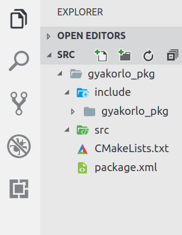
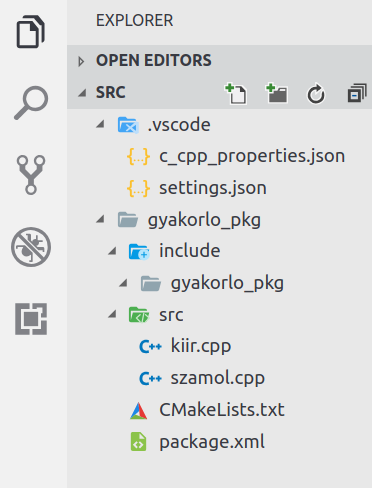
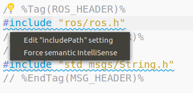

# ROS node-ok készítése pythonban és C++-ban

Tartalom:
- ROS wokrspace-k, pacakage-k, node-ok
- Publisher / Subscriber node C++-ban
- Publisher / Subscriber node pythonban
- rqt_graph

## Előkészületek

Az előző alkalommal letöltött rosbag fájl most is kelleni fog.

```
mkdir ~/rosbag-gyak
cd ~/rosbag-gyak
wget www.sze.hu/~herno/PublicDataAutonomous/leaf-2019-03-13-a-no-lidar.bag
```

## Catkin workspace készítése
Nyissuk meg, a home folderban lévő `.bashrc` fájlt (pl VS code segítségével) és ellenőrizzük, hogy tartalmaz-e egy `source /opt/ros/kinetic/setup.bash` sort valahol a fájl végén.

```
code ~/.bashrc
```
Hozzunk létre egy gyakolró catkin workspace-t:

```
mkdir -p ~/gyakorlo_ws/src
cd ~/gyakorlo_ws/
catkin build
```

Ha `ls` paranccsal listázzuk a könyvtár tartalmát, a tipikus workspace felépítést láthatjuk.

```
build  devel  logs  src
```
Egy workspace több pacake-t tartalmaz.
Most készítsük el a `gyakorlo_pkg` nevű pacake-t, ami majd több node-ot tartalmaz, majd nyissuk meg VS code segítségével az `src` mappát.

```
cd ~/gyakorlo_ws/src
catkin_create_pkg gyakorlo_pkg nav_msgs std_msgs rospy roscpp
code .
```
Eddig így néz ki a workspace.



## C++ fájlok beszerzése

A `gyakorlo_ws/src/gyakorlo_pkg/src` mappába töltsünk le két cpp fájlt.

```
cd ~/gyakorlo_ws/src/gyakorlo_pkg/src
wget https://raw.githubusercontent.com/horverno/ros-gyakorlatok/master/2-ros-node-tobb-nyelven/kiir.cpp
wget https://raw.githubusercontent.com/horverno/ros-gyakorlatok/master/2-ros-node-tobb-nyelven/szamol.cpp
```



Annak érdekében, hogy a VS code automatikus kiegészítsé funkciója jól működjön, a hiányzónak jelölt incudnál, (`ros/ros.h`), kattintsunk a sárga ikonra, majd `Edit "includepath" settings` és egészítsük ki egy veszzővel, plusz a `"/opt/ros/kinetic/include"` sorral. Így már megtalálja az ROS-specifikus dolgokat.




``` yaml
{
    "configurations": [
        {
            "name": "Linux",
            "includePath": [
                "${workspaceFolder}/**",
                "/opt/ros/kinetic/include"
            ],
            "defines": [],
            "compilerPath": "/usr/bin/gcc",
            "cStandard": "c11",
            "cppStandard": "c++11",
            "intelliSenseMode": "clang-x64"
        }
    ],
    "version": 4
}
```

Két node-ot szeretnénk a két cpp fájlból létrehozni. 
A `csak_kiiras_node` csak kiírná a beolvasott gps és leaf biciklo modell által számolt odometriát.
A `tavolsag_szamitas_node` publisholná a két odometria különbségét (távolságát).
Módosítsuk a [`CMakeLists.txt`](CMakeLists.txt)-t így.

``` cmake
cmake_minimum_required(VERSION 2.8.3)
project(gyakorlo_pkg)

add_compile_options(-std=c++11)

find_package(catkin REQUIRED COMPONENTS
  nav_msgs
  roscpp
  rospy
  std_msgs
)

catkin_package(
#  INCLUDE_DIRS include
#  LIBRARIES gyakorlo_pkg
#  CATKIN_DEPENDS nav_msgs roscpp rospy std_msgs
#  DEPENDS system_lib
)

include_directories(
# include
  ${catkin_INCLUDE_DIRS}
)


add_executable(tavolsag_szamitas_node src/szamol.cpp)
target_link_libraries(tavolsag_szamitas_node ${catkin_LIBRARIES})

add_executable(csak_kiiras_node src/kiir.cpp)
target_link_libraries(csak_kiiras_node ${catkin_LIBRARIES})

```

Nyissuk meg a `.bashrc` fájlt (`code ~/.bashrc`) és adjuk hozzá a `source ~/gyakorlo_ws/devel/setup.bash` sort. Innentől kezdve bárhonnan elérhetjük a workspace-t, és bárhonnan elindíthatjuk a a package különböző node-jait `rosrun` segítségével. 

```
cd /
roscd gyakorlo_pkg
catkin build
```

Most már bárhonnan indítható a 2 node.

```
rosrun gyakorlo_pkg csak_kiiras_node
rosrun gyakorlo_pkg tavolsag_szamitas_node
```

Vizsgáljuk meg a c++ fájlok működését és a node-ok végrahajtását!

## ROS node pythonban

Pythonban nem kell külön a CMakeListset `add_executable(..)` sorral kiegészítenünk. Minden .py fájl, aminek van futtatási joga (`chmod`) és a scripts mappában található, automatikusan node lesz.

A scripts mappába tegyük bele, az előző alkalommal megismert plotter fájlt, és adjunk futtatható jogot.

```
wget https://raw.githubusercontent.com/horverno/ros-gyakorlatok/master/1-rosbag-es-topicok/plotterLeaf.py
sudo chmod +x plotterLeaf.py
```

A C++-hoz hasonlóan, most már bárhonnan indítható a node.

```
rosrun gyakorlo_pkg plotterLeaf.py
```

## Önálló feladat

Jelezzük ki a `/distance` topicot két tizedesjegyig, számként a `plotterLeaf.py` node-ban.

## További részletek

http://wiki.ros.org/ROS/Tutorials