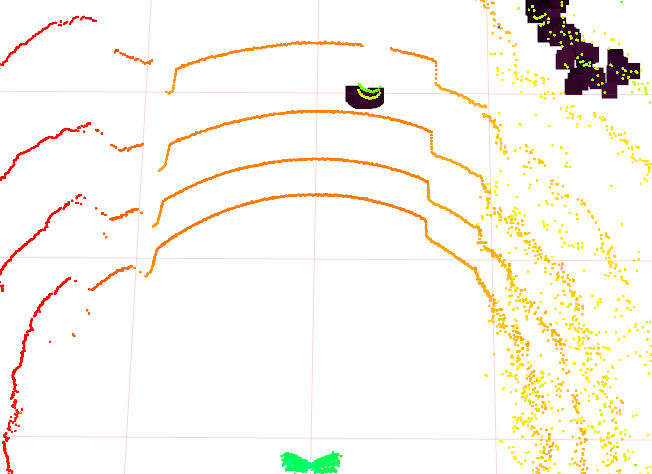

# ROS szenzoradatokfeldolgozása C++ node-al

## Tartalom
- [Előkészületek](#elo)
- [Rviz](#rviz)

<a name="elo"></a>

## Előkészületek

Az előző gyakorlatok után továbbhaladva, azok eredményeit felhasználva lépünk tovább. Töltsük le a több szenzoradatot is tartalmazó rosbag fájlt.

```
cd ~/rosbag-gyak
wget www.sze.hu/~herno/PublicDataAutonomous/leaf-2019-09-12-15-10-46-gps-lidar-zala.bag
wget www.sze.hu/~herno/PublicDataAutonomous/leaf-v1.rviz
```

Jelenítsük meg az információkat.

```
rosbag info leaf-2019-09-12-15-10-46-gps-lidar-zala.bag
```

Leginkább 2 topic lesz számunkra fontos:

```
/points_raw      182 msgs    : sensor_msgs/PointCloud2
/scan            482 msgs    : sensor_msgs/LaserScan
```


```
$ rosmsg info sensor_msgs/PointCloud2
std_msgs/Header header
  uint32 seq
  time stamp
  string frame_id
uint32 height
uint32 width
sensor_msgs/PointField[] fields
  uint8 INT8=1
  uint8 UINT8=2
  uint8 INT16=3
  uint8 UINT16=4
  uint8 INT32=5
  uint8 UINT32=6
  uint8 FLOAT32=7
  uint8 FLOAT64=8
  string name
  uint32 offset
  uint8 datatype
  uint32 count
bool is_bigendian
uint32 point_step
uint32 row_step
uint8[] data
bool is_dense
```

```
$ rosmsg info sensor_msgs/LaserScan 
std_msgs/Header header
  uint32 seq
  time stamp
  string frame_id
float32 angle_min
float32 angle_max
float32 angle_increment
float32 time_increment
float32 scan_time
float32 range_min
float32 range_max
float32[] ranges
float32[] intensities
```

<a name="rviz"></a>
## rviz

```
rosrun rviz rviz -d ~/rosbag-gyak/leaf-v1.rviz
```



```
$ catkin create pkg using_markers --catkin-deps roscpp visualization_msgs
```

# TODO