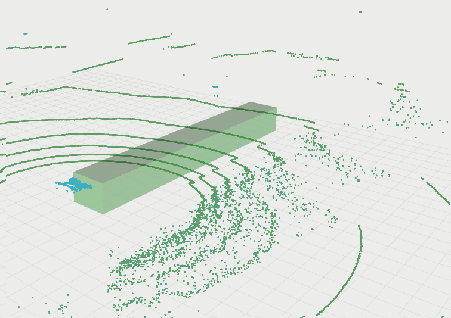
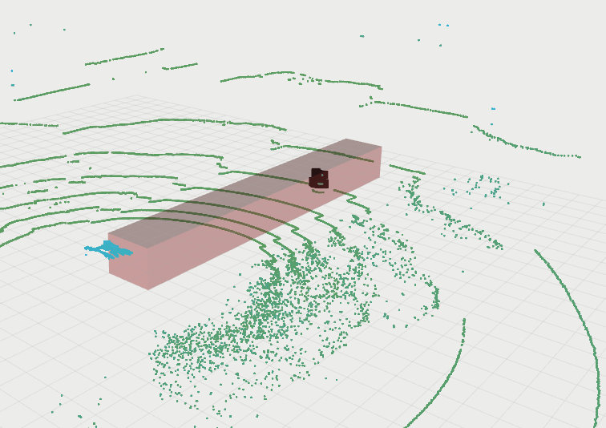

# ROS szenzoradatok feldolgozása C++ node-al

## Tartalom
- [Előkészületek](#elo)
- [Rviz](#rviz)
- [Package és node készítése egyszerű LIDAR szűrésre, vizualizációra](#pack)

<a name="elo"></a>

## Előkészületek

Az előző gyakorlatok után továbbhaladva, azok eredményeit felhasználva lépünk tovább. Töltsük le a több szenzoradatot is tartalmazó rosbag fájlt.

```
cd ~/rosbag-gyak
wget www.sze.hu/~herno/PublicDataAutonomous/leaf-2019-09-12-15-10-46-gps-lidar-zala.bag
wget www.sze.hu/~herno/PublicDataAutonomous/leaf-v1.rviz
```

Jelenítsük meg az információkat.

```
rosbag info leaf-2019-09-12-15-10-46-gps-lidar-zala.bag
```

Leginkább 2 topic lesz számunkra fontos:

```
/points_raw      182 msgs    : sensor_msgs/PointCloud2
/scan            482 msgs    : sensor_msgs/LaserScan
```


```
$ rosmsg info sensor_msgs/PointCloud2
std_msgs/Header header
  uint32 seq
  time stamp
  string frame_id
uint32 height
uint32 width
sensor_msgs/PointField[] fields
  uint8 INT8=1
  uint8 UINT8=2
  uint8 INT16=3
  uint8 UINT16=4
  uint8 INT32=5
  uint8 UINT32=6
  uint8 FLOAT32=7
  uint8 FLOAT64=8
  string name
  uint32 offset
  uint8 datatype
  uint32 count
bool is_bigendian
uint32 point_step
uint32 row_step
uint8[] data
bool is_dense
```

```
$ rosmsg info sensor_msgs/LaserScan 
std_msgs/Header header
  uint32 seq
  time stamp
  string frame_id
float32 angle_min
float32 angle_max
float32 angle_increment
float32 time_increment
float32 scan_time
float32 range_min
float32 range_max
float32[] ranges
float32[] intensities
```

<a name="rviz"></a>
## rviz
```
rosbag play -l leaf-2019-09-12-15-10-46-gps-lidar-zala.bag
```

```
rosrun rviz rviz -d ~/rosbag-gyak/leaf-v1.rviz
```


```
$ catkin create pkg using_markers --catkin-deps roscpp visualization_msgs
```

<a name="pack"></a>

# Package és node készítése egyszerű LIDAR szűrésre, vizualizációra

```
cd ~ ; mkdir -p gyak_ws/src ; cd gyak_ws/src
```


```
catkin create pkg lidar_tutorial --catkin-deps roscpp pcl_conversions pcl_ros roscpp sensor_msgs visualization_msgs
```

Mentsük le a 3 cpp fájlt:
```
cd gyak_ws/src/lidar_tutorial/src ; wget https://raw.githubusercontent.com/horverno/ros-gyakorlatok/master/3-ros-node-szenzoradatok/lidar_and_marker.cpp ; wget https://raw.githubusercontent.com/horverno/ros-gyakorlatok/master/3-ros-node-szenzoradatok/lidar_filter.cpp ; wget https://raw.githubusercontent.com/horverno/ros-gyakorlatok/master/3-ros-node-szenzoradatok/pub_marker.cpp
```

```
code .
```


A VS code automatikus kiegészítés funkciója akkor műkidik jól, a hiányzónak jelölt incudenál, (pl. `ros/ros.h`), kattintsunk a sárga villanykörte ikonra, majd `Edit "includepath" settings` részre megyünk és az `Include path` mezőbe a következőke írjuk:

``` yaml
${workspaceFolder}/**
/opt/ros/melodic/include
/opt/ros/melodic/include/pcl
/usr/include
/usr/include/pcl-1.7
/usr/include/eigen3
```
Megjegyzés a későbbiekben (AutoWare használatakor) hasznos lehet még a következő is:
``` yaml
~/autoware_ws/Autoware/ros/devel/include
```

``` cmake
add_executable(publish_marker src/pub_marker.cpp)
target_link_libraries(publish_marker ${catkin_LIBRARIES})

add_executable(basic_lidar_filter src/lidar_filter.cpp)
target_link_libraries(publish_marker ${catkin_LIBRARIES})

add_executable(lidar_and_marker src/lidar_and_marker.cpp)
target_link_libraries(lidar_and_marker ${catkin_LIBRARIES})
```

Szerkesszük a `~/.bashrc`-t (`code ~/.bashrc`)

```
source ~/gyak_ws/devel/setup.bash
```





Az egyszerű filter (`lidar_filter.cpp`) tartalma a következő:

``` cpp
#include <ros/ros.h>
#include <pcl_conversions/pcl_conversions.h>
#include <pcl/point_cloud.h>
#include <pcl/point_types.h>
#include <pcl/filters/voxel_grid.h>
#include <pcl/filters/crop_box.h>

ros::Publisher pub;
ros::Publisher marker_pub;

void cloud_cb(const pcl::PCLPointCloud2ConstPtr &cloud)
{
    pcl::PCLPointCloud2 cloud_filtered;

    // Define min and max for X, Y and Z
    float minX = 0.0, minY = -1.0, minZ = -1.384;
    float maxX = 16.0, maxY = +1.0, maxZ = -0.15;

    pcl::CropBox<pcl::PCLPointCloud2> boxFilter;
    boxFilter.setMin(Eigen::Vector4f(minX, minY, minZ, 1.0));
    boxFilter.setMax(Eigen::Vector4f(maxX, maxY, maxZ, 1.0));
    boxFilter.setInputCloud(cloud);
    boxFilter.filter(cloud_filtered);
    if(cloud_filtered.data.size() > 10) 
        ROS_WARN_STREAM("Object in the selected area");

    // Publish the filtered LIDAR data
    pub.publish(cloud_filtered);

}

int main(int argc, char **argv)
{
    // Initialize ROS
    ros::init(argc, argv, "lidar_filt");
    ros::NodeHandle nh;
    // Create a ROS subscriber for the input point cloud
    ros::Subscriber sub = nh.subscribe("points_raw", 1, cloud_cb);

    // Create a ROS publisher for the output point cloud
    pub = nh.advertise<pcl::PCLPointCloud2>("points_filt", 1);

    // Spin
    ros::spin();
}
```

